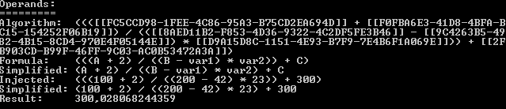

# Engine

Very basic compute engine that allows you to recover the algorithm as a human readable string.

## Example

```c#
var var1 = new Operand(@"var1", 1);
var var2 = new Operand(@"var2", 2.22);
var var3 = new Operand(@"Pi", Math.PI);

var result = (var1 + var2) * var3;

Console.WriteLine(@"Formula:  " + result.GetFormula());
Console.WriteLine(@"Injected: " + result.GetFormula(true));
Console.WriteLine(@"Result:   " + result.Value);

Console.WriteLine();

result = Operand.Max(var1, Operand.Min(var2, var3));

Console.WriteLine(@"Formula:  " + result.GetFormula());
Console.WriteLine(@"Injected: " + result.GetFormula(true));
Console.WriteLine(@"Result:   " + result.Value);

Console.WriteLine();

result = Operand.Round(Operand.Floor(var1 * var2 / var3) / Operand.Ceiling(var1 * var2 / var3));

Console.WriteLine(@"Formula:  " + result.GetFormula());
Console.WriteLine(@"Injected: " + result.GetFormula(true));
Console.WriteLine(@"Result:   " + result.Value);

Console.WriteLine();

result = Operand.Round(Operand.Floor(var1 * var2 / var3).AsConstant(@"FLOOR") /
    Operand.Ceiling(var1 * var2 / var3).AsConstant(@"CEILING"));

Console.WriteLine(@"Formula:  " + result.GetFormula());
Console.WriteLine(@"Injected: " + result.GetFormula(true));
Console.WriteLine(@"Result:   " + result.Value);

Console.WriteLine();

result = var3 % (2 + 1);

Console.WriteLine(@"Formula:  " + result.GetFormula());
Console.WriteLine(@"Injected: " + result.GetFormula(true));
Console.WriteLine(@"Result:   " + result.Value);

Console.WriteLine();

Console.ReadKey(false);
```



See Demo project for an example on how to use this.
