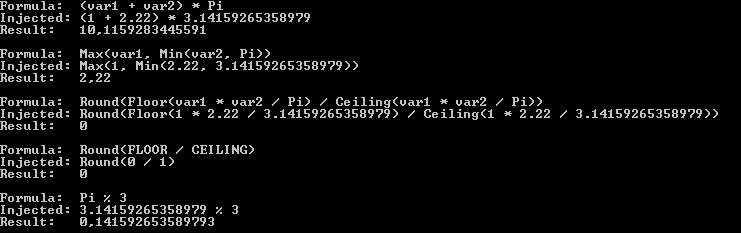

# Engine

Very basic compute engine that allows you to recover the algorithm as a human readable string.

## Example

```c#
class Constants
{
  [Constant]
  public Operand A = new Operand(@"A", 100);
  [Constant]
  public Operand B = new Operand(@"B", 200);
  [Constant]
  public Operand C = new Operand(@"C", 300);
}

// ...

var c = new Constants();
var var1 = new Operand(@"var1", 42);
var var2 = new Operand(@"var2", 23);

var simple = (c.A + 2) / ((c.B - var1) * var2) + c.C;
var algorithm = Evaluator.RecoverAlgorithm(simple, out var operands);
var injected = Evaluator.InjectValues(algorithm, null, operands.ToArray());
var formula = Evaluator.GetFormula(algorithm, null, operands.ToArray());
var simplified = Evaluator.Simplify(formula);
var simplifiedInjected = Evaluator.Simplify(injected);
Console.WriteLine("Operands:");
Console.WriteLine("=========");
Console.WriteLine(@"Algorithm:  " + algorithm);
Console.WriteLine(@"Formula:    " + formula);
Console.WriteLine(@"Simplified: " + simplified);
Console.WriteLine(@"Injected:   " + injected);
Console.WriteLine(@"Simplified: " + simplifiedInjected);
Console.WriteLine(@"Result:     " + simple.Value);
```



See Demo project for an example on how to use this.
